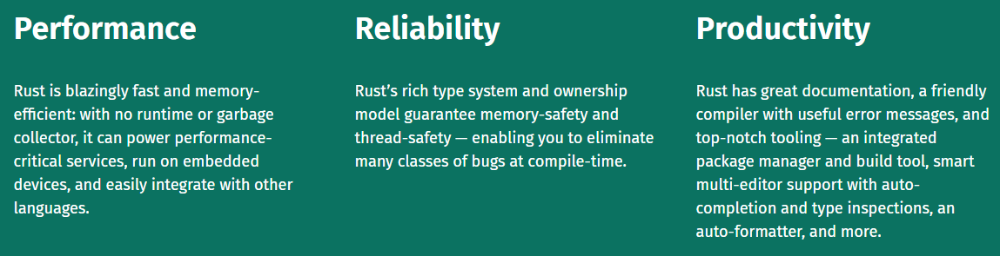

_Introduction >> [Basics](./basics.md)_

# Introduction
- [Rust is a multi-paradigm programming language focused on performance and safety, especially safe concurrency.](https://en.wikipedia.org/wiki/Rust_(programming_language))
- [Rust is syntactically similar to C++, and provides memory safety without using garbage collection.](https://en.wikipedia.org/wiki/Rust_(programming_language))

Multi-paradigm includes:

- Concurrent computing.
- Generic programming.
- Functional programming.
- Structured programming.

[Visual example of Rust memory management with lifetimes and without garbage collection.](https://speakerdeck.com/deepu105/rust-stack-vs-heap-usage) - [Original article](https://deepu.tech/memory-management-in-rust/)

## Why Rust?

##### According to the Rust Website

##### [Improvements it aimed and achieved compared to C/C++](https://www.oreilly.com/programming/free/files/why-rust.pdf)

###### Type Safety

Type safety prevents undefined behaviour.

_`Undefined behavior`_ : behavior, upon use of a nonportable or erroneous program construct or of erroneous data, for which this International Standard
imposes no requirements.

C/C++ does not prevent it, but other high level language (like Python) does have type safety by doing necessary checks on runtime.

###### Memory Safety

- _`No null pointer dereferences.`_ Your program will not crash
because you tried to dereference a null pointer.
- _`No dangling pointers.`_ Every value will live as long as it must.
Your program will never use a heap-allocated value after it has
been freed.
- _`No buffer overruns.`_ Your program will never access elements
beyond the end or before the start of an array.

It achieves the above promises by introducing new concepts in programming: [ownership, borrowing](https://www.youtube.com/watch?v=2IxQgXQl_Ws).

Ownership rules:

1. Each value had a variable which is its owner.
1. There can only be one owner at any given time.
1. When the owner goes out of scope, the value will be dropped out of memory.

Borrowing Rules:

1. Allowed infinite borrows for readonly access.
1. Readonly borrows make the original data immutable for their duration.
1. Only allowed to pass one borrow at a time for write access/mutablility.

###### Concurrency Without Data Races

###### _Some articles/books that you could read if you are interested:_

- [Introduction to Rust](https://serokell.io/blog/rust-guide)
- [What is Rust and why is it so popular?](https://stackoverflow.blog/2020/01/20/what-is-rust-and-why-is-it-so-popular/)
- [Why Rust](https://www.oreilly.com/programming/free/files/why-rust.pdf)

## Build it in Rust!

- [Building Tools](https://www.rust-lang.org/what/cli)
- [Writing Web Apps](https://www.rust-lang.org/what/wasm)
- [Working on Servers](https://www.rust-lang.org/what/networking)
- [Starting with Embedded](https://www.rust-lang.org/what/embedded)

## Content Overview

1. [Basics](./basics.md)
1. [Types and Variables](./types-and-variables.md)
1. [Control Flow](./control-flow.md)
1. [Data Structures](./data-structures.md)
1. [Pattern Matching](./pattern-matching.md) 
1. [Generics](./generics.md) 
1. [Standard Collections](./standard-collections.md)
1. [Functions](./functions.md)
1. [Lifetime and Memory](./lifetime-memory.md)
1. [Advanced Topics](./advanced-topics.md)
1. [Concurrency](./concurrency.md)
