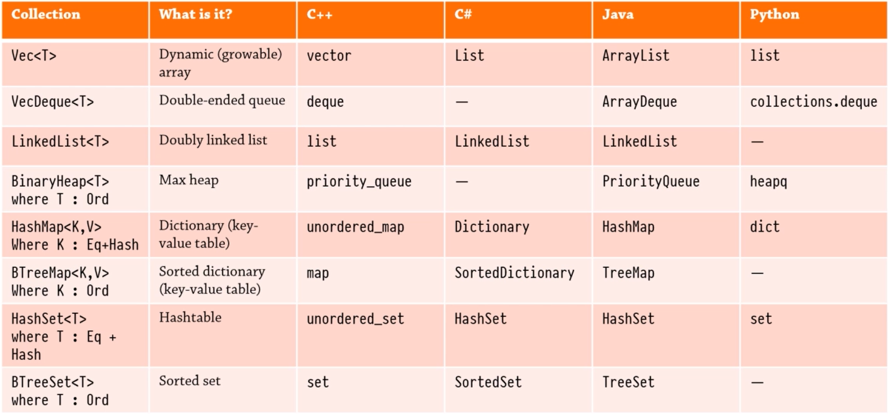

_[Generics](./generics.md) << Standard Collections >> [Characters and Strings](./characters-strings.md)_

# Standard Collections

Overview of collections from [The Rust Programming Language Udemy Course](https://www.udemy.com/course/rust-lang/)

## Vec(tor)

## Hashmap

## Hashset

## Iterators